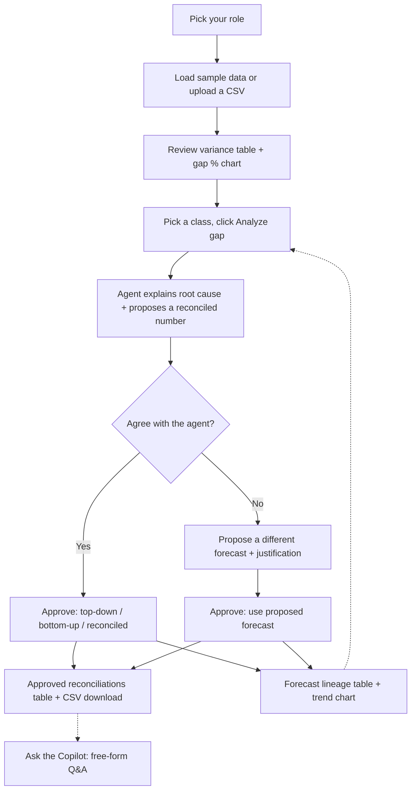
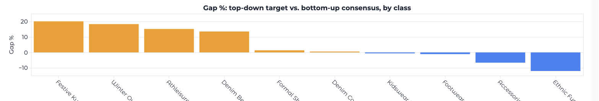
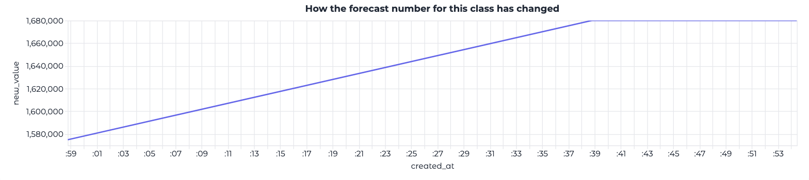

# Forecast Reconciliation Agent

An agentic demo that sits between a top-down financial target and each
planner's bottom-up build (Store Plan, Line Plan, Class Plan), surfaces
every material gap, explains why it exists, and proposes a reconciled
number both sides can approve — turning the plan-vs-plan handshake into an
always-on collaborative negotiation instead of a week of email
back-and-forth.

Planners and finance users can also propose their own forecast (with a
required justification) against any class, tagged with their role. Every
agent recommendation, proposal, and approval is written to a local SQLite
database as a chained, append-only event, so the full lineage of a
number — who changed it, in what order, and why — is always available for
audit.

Built with **LangChain**, **Groq** (`openai/gpt-oss-20b`), and a **Gradio**
front end. See [HLD.md](./HLD.md) for the architecture and
[ROADMAP.md](./ROADMAP.md) for what's next.

## What it does

- Loads a plan-vs-plan dataset (top-down target + Store/Line/Class Plan
  totals, one row per merchandise class).
- Computes variance and root-cause signals deterministically in Python:
  rate-of-sale shift, carryover assumption, new-store ramp, and
  planner-to-planner disagreement across the three bottom-up views.
- Sends those signals (not raw data) to an LLM (Groq's `openai/gpt-oss-20b`
  via LangChain) to narrate the likely root cause and propose a reconciled
  number, with a confidence level and a recommended approver.
- Lets a user select their role (Store Planner, Line Planner, Class
  Planner, Finance, Merchandising Lead), approve top-down, bottom-up, the
  reconciled number, or a proposed forecast per class, or propose their
  own number with a justification.
- Persists every recommendation, proposal, and approval to SQLite as an
  immutable, chained lineage event — viewable per class in the UI, and
  queryable directly from the database file.
- Includes a conversational copilot tab — ask "why is Denim Best behind
  plan?" or "which classes have the biggest gap?" and a tool-calling
  LangChain agent answers by querying the same reconciliation logic.

## User journey



Every path through **Approve** or **Propose → Approve** writes a chained
event to the SQLite lineage log — the loop back into **Analyze gap** shows
that a class can be revisited any number of times, each pass adding to the
same audit trail.

## Project layout

```
forecast-reconciliation-agent/
├── pyproject.toml
├── .env.example
├── README.md
├── HLD.md
├── sample_data/
│   └── plans.csv                # synthetic top-down + bottom-up plan data
└── src/forecast_reconciliation_agent/
    ├── data.py                  # CSV loading
    ├── reconciliation.py        # deterministic variance/signal math
    ├── models.py                # Pydantic schema for the LLM's structured output
    ├── db.py                    # SQLite persistence + forecast lineage
    ├── agent.py                 # LangChain + Groq chain and tool-calling agent
    └── app.py                   # Gradio UI
```

## Setup

Requires [uv](https://docs.astral.sh/uv/) and Python 3.11+.

1. Get a free Groq API key: https://console.groq.com/keys
2. Copy the env template and add your key:

   ```bash
   cp .env.example .env
   # edit .env and set GROQ_API_KEY=gsk_...
   ```

3. Install dependencies:

   ```bash
   uv sync
   ```

4. Run the app:

   ```bash
   uv run forecast-reconciliation-agent
   # or: uv run python -m forecast_reconciliation_agent.app
   ```

   Gradio will print a local URL (default `http://127.0.0.1:7860`).

No database setup is required — a `forecast_reconciliation.db` SQLite file
is created automatically in the project root on first run.

## Usage guide

### 1. Pick your role

At the top of the app, select the role you're acting as (Store Planner,
Line Planner, Class Planner, Finance, or Merchandising Lead). This is
attached to every proposal or approval you record for the rest of the
session — switch it any time you're acting on behalf of a different role.

### 2. Review the variance table

The **Reconciliation Dashboard** tab loads the sample dataset automatically
and shows every merchandise class sorted by the size of its top-down vs.
bottom-up gap, along with the root-cause flags that were triggered
(`rate_of_sale_shift`, `carryover_assumption`, `new_store_ramp`,
`planner_disagreement`, `unexplained_gap`). A bar chart below the table
shows the same gap % per class, sorted largest to smallest, colored by
whether the top-down target or the bottom-up consensus is ahead:



To reconcile your own data instead, upload a CSV with the same columns as
`sample_data/plans.csv`.

### 3. Analyze a gap

Pick a class from the dropdown and click **Analyze gap**. The agent
explains the likely root cause, proposes a reconciled number, and states
its confidence and a suggested approver. This is automatically logged as
an `agent_recommendation` lineage event.

### 4. Approve, or propose an alternative

- Click one of the **Approve** buttons to accept the top-down target, the
  bottom-up consensus, or the agent's reconciled number. Approved rows
  accumulate in the "Approved reconciliations" table, downloadable as CSV,
  tagged with your role.
- Or, if you disagree with the agent's number, fill in **Propose a
  different forecast** with your own value and a required justification,
  then click **Submit proposal**. This is recorded against your role and
  chained to whatever the previous number was — it does not become
  official on its own.
- To make a submitted proposal the official number, click **Approve: use
  proposed forecast**. This looks up the latest proposal for the selected
  class, records it as the approved value, and notes in the lineage who
  originally proposed it. If no proposal exists yet for the class, you'll
  get a message instead of a silent no-op.

### 5. Review the lineage

The **Forecast lineage** table shows the full, chronologically ordered
history for the currently selected class: every agent recommendation,
proposal, and approval, with who made it, the previous and new value, and
the justification behind it. This comes straight from the SQLite database,
so it survives app restarts. Below the table, a line chart plots the same
history as a trajectory of the forecast number over time, so you can see
at a glance whether proposals and approvals pulled the number up or down:



### 6. Ask the copilot

The **Ask the Copilot** tab is a free-form chat interface grounded in the
same reconciliation tools — ask things like "why is Denim Best behind
plan?" or "which classes have the biggest gap?".

## Inspecting the lineage database directly

The SQLite file lives at `forecast_reconciliation.db` in the project root.
For example, to see the full event history for every class:

```bash
sqlite3 forecast_reconciliation.db \
  "SELECT class_name, event_type, role, previous_value, new_value, created_at FROM forecast_events ORDER BY id;"
```

## Configuration

Set in `.env` (see `.env.example`):

| Variable | Purpose | Default |
|---|---|---|
| `GROQ_API_KEY` | Groq API key (required) | — |
| `GROQ_MODEL` | Groq model id | `openai/gpt-oss-20b` |

## Notes / scope

This is a scoped-down demo, not a production integration:

- The dataset is a flat CSV, not a live feed from a planning system.
- Root-cause **flags** (rate-of-sale shift, carryover assumption, new-store
  ramp, planner disagreement) are simple threshold rules computed in
  Python; the LLM narrates and weighs them, it does not compute the
  numbers itself.
- Roles are self-declared in a dropdown, not enforced by authentication.
- Thresholds in `reconciliation.py` are illustrative and would need
  calibration against real historical data before use.

## License

All rights reserved. See [LICENSE](./LICENSE).
